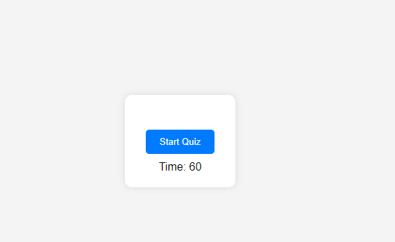
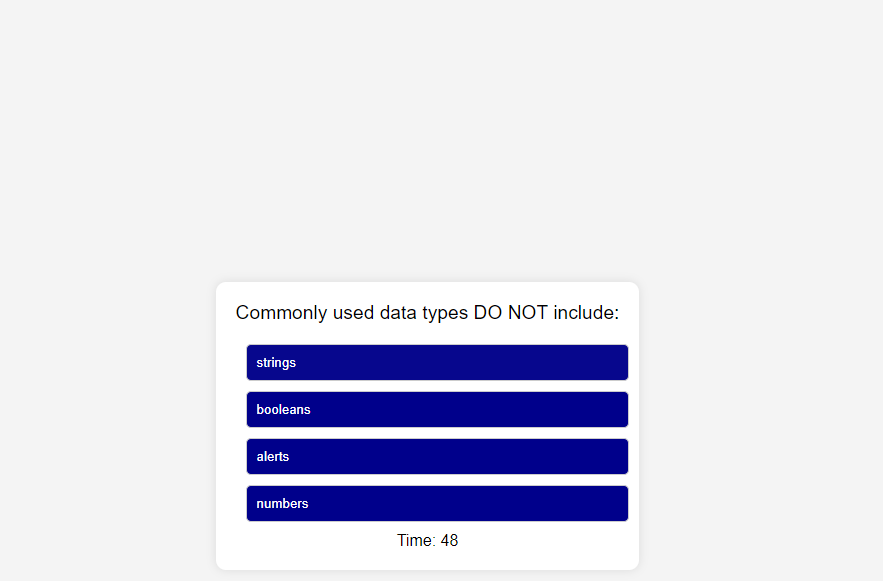
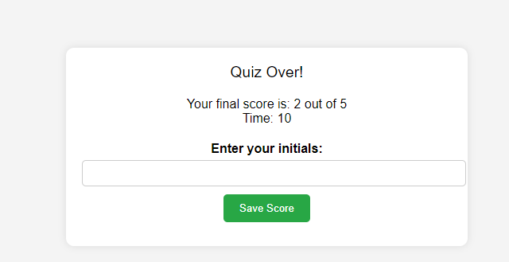

# KnowledgeCheckonJavascript

Test your JavaScript knowledge with this interactive multiple-choice quiz! The quiz presents a set of questions and provides a timer for each question. Your final score is calculated based on the number of correct answers you provide. At the end of the quiz, you can save your initials and score for future reference.

## Features

- Multiple-choice questions with options.
- Timer that counts down while answering questions.
- Score calculation based on the number of correct answers.
- Ability to save initials and score at the end of the quiz.

## Installation

1. Clone this repository to your local machine.
2. Open the `index.html` file in a web browser.

## Usage

1. Open the `index.html` file in a web browser.
2. Click the "Start Quiz" button to begin.
3. Read the questions and select an answer by clicking on the provided options.
4. The timer will countdown for each question.
5. The quiz ends when all questions are answered or the timer reaches 0.
6. After the quiz, you can save your initials and score for reference.

## Screenshots

### Quiz Start

_The quiz starts with a set of questions and a timer._

### Question Example

_An example of a multiple-choice question with options._

### Quiz End

_After completing the quiz, you can save your initials and view your score._

## Acknowledgments

- This quiz project was inspired by the JavaScript programming language.
- Thanks to [w3schools](https://www.w3schools.com/) for providing valuable resources.

## License

This project is licensed under the MIT License.

---

Feel free to contribute to this project by opening issues or submitting pull requests. Your contributions are highly appreciated!